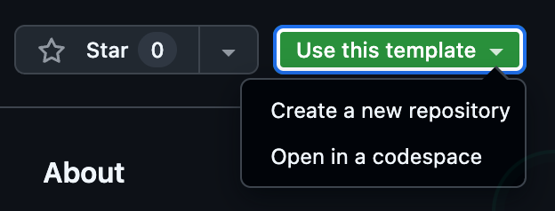
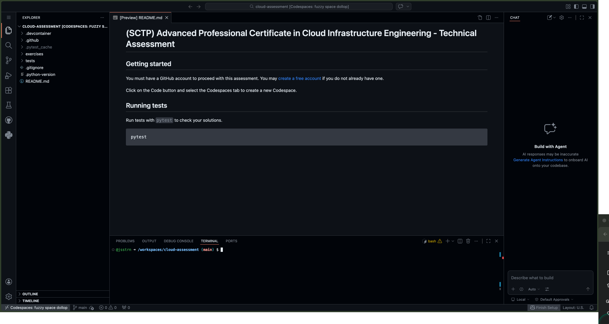
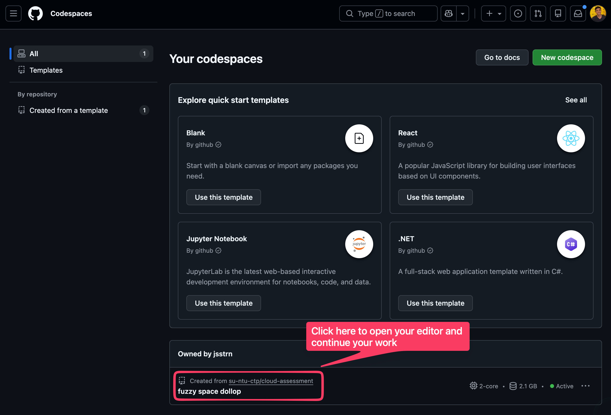
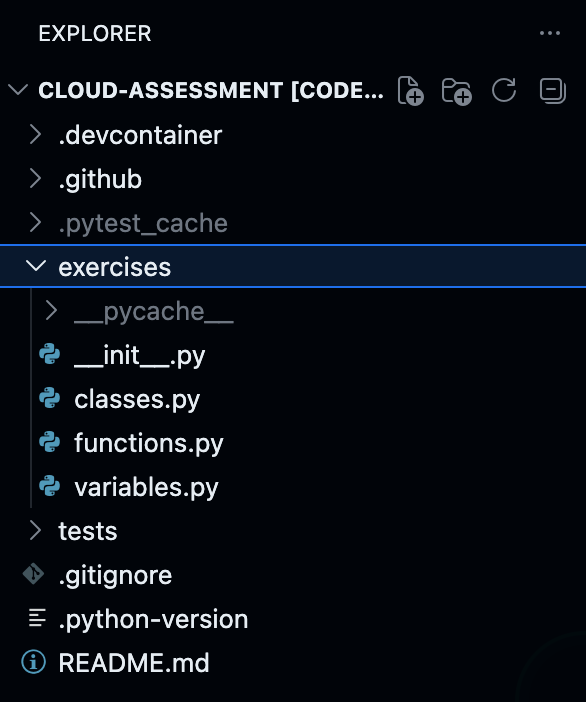
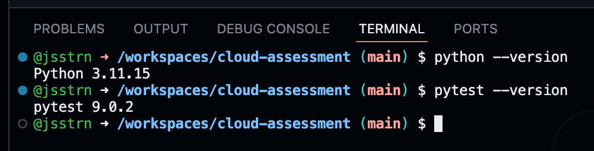
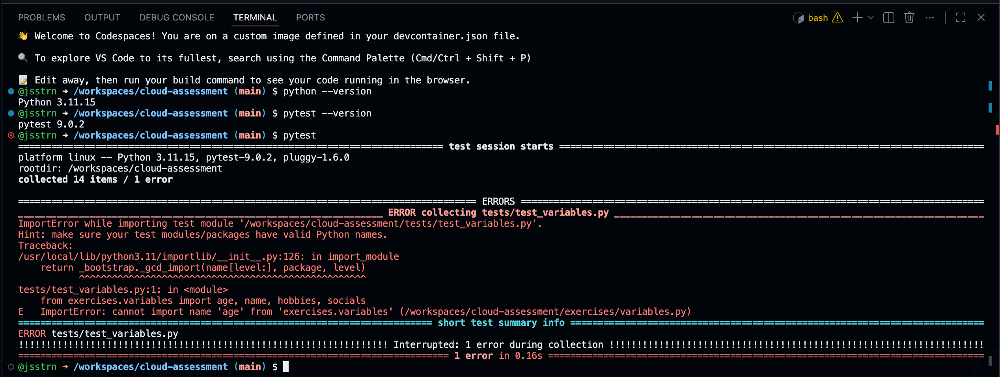

# (SCTP) Advanced Professional Certificate in Cloud Infrastructure Engineering - Technical Assessment

## Requirements

1. You should have a GitHub account. Create one: [https://github.com/signup](https://github.com/signup).
1. You should know some basic Python programming knowledge.
1. You should know how to run basic shell commands on the terminal.
1. You should know how to use a code editor, like Visual Studio Code.

‼️ IMPORTANT: You DO NOT need to run or install anything on your computer for this assessment. Everything can be run directly from your web browser.

## Getting started



1. Login with your GitHub account.
1. Click on the big green button that says "Use this template" and select "Open in a codespace".
1. Give some time for the codespace to set itself up. This may take several minutes. Be patient.

If you did everything correctly, you should see something similar to this:



## Saving your work

Codespace saves your work automatically. You can navigate to [https://github.com/codespaces](https://github.com/codespaces) to view your codespace.

This means you can close the editor and come back to complete your work at a later time. When you are ready to continue, just head to your codespace and click on it to open the editor.



## Navigate to your exercise files

Go to the exercises folder.



You will see 3 files, namely, `classes.py`, `functions.py`, and `variables.py`. You may ignore the `__init__.py` file.

Complete all the exercises in these 3 files. Run the tests to check your work. Once all tests have passed. You can submit your work.

## Check your dependencies

In the terminal, run the following commands to make sure everything is working properly.

Check the version of python. You should see `Python 3.11.15`.

```sh
python --version
```

Check the version of pytest. You should see `pytest 9.0.2`.

```sh
pytest --version
```



## Run tests

In the Codespaces terminal, run all tests with the command `pytest`.

```sh
pytest
```


